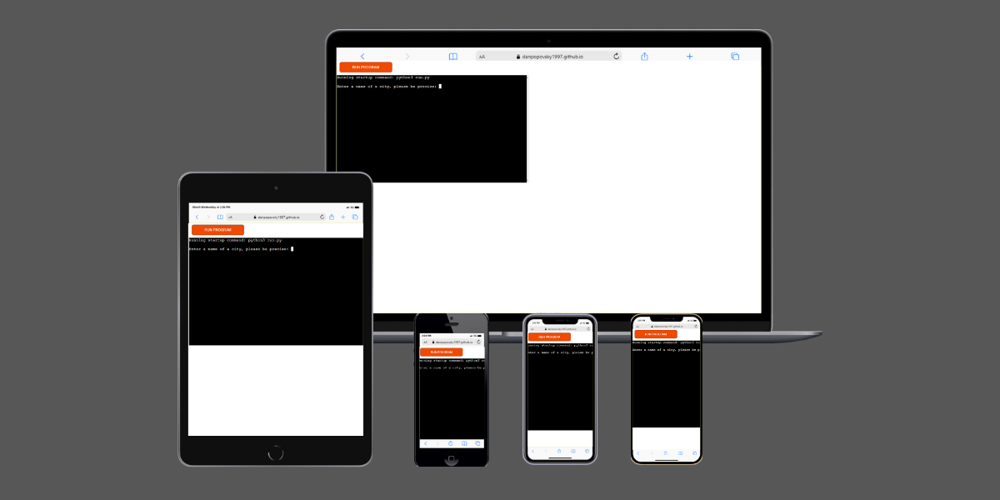
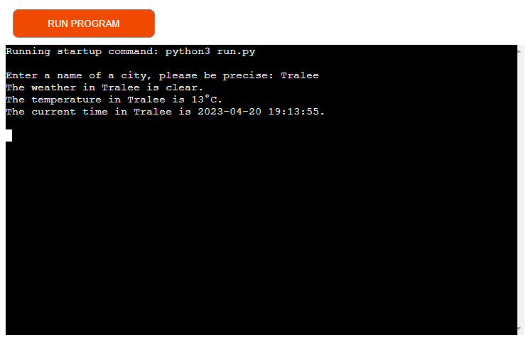
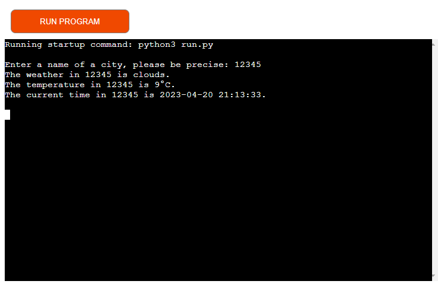
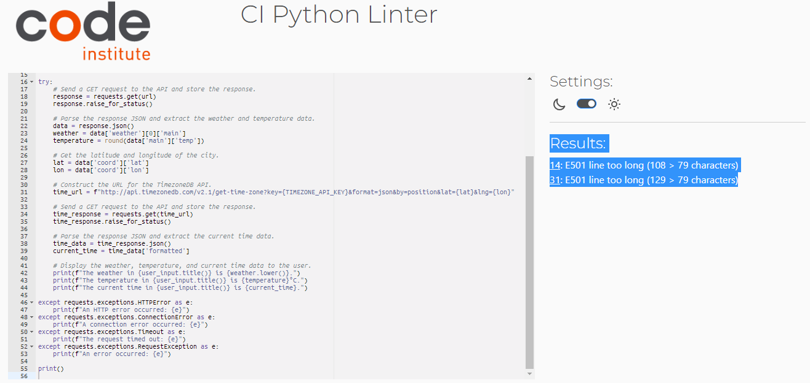

# Weather App
(Developer: Daniel Popovsky)

[Live Running Program](https://weather-app-project-3.herokuapp.com/)

The Weather App is an application that was developed to demonstrate some of the uses Python may have when it comes to building software applications. This application aims to show the user how Python is used to create basic functionality using various functions.

Within this application the user will be able to obtain information about a specific city and it's: 1. Weather type, 2. temperature in degrees celcius and lastly 3. Date and time of the city. Although simple, it provides an insight into how information is obtained from various API and communicated within a terminal.

## Software Used
- Python
- Heroku

## Features
The application has one feature in which it provides a total of 3 pieces of information. The intended use of the application is for the user to obtain information about the current weather, temperature and date as well as time. The process of obtaining this information is: Inputting a city of choice (it is important to be precise about the location) in which it provides the user with:
A. The weather type.
B. The temperature in Degrees Celcius.
C. The date and time of the location inputted.

Although a simple function, it shows how Python is used when it comes to extracting informtaion from the API.

### Planned Features
To expand this project further and to allow the user to interact more with the application within the terminal I have planned to:
- Implement a process in which inputs a location, and in turn asks the user to select from three options and input either A, B or C, the options being:
A. Would you like to know the weather?
B. Would you like to know the temperature?
C. Would you like to know the date?
- Implement a loop system so the user does not have to run the program each time before inputting a location.
- Implement the use of Eircodes and postcodes to allow for more precise and accurate data.

## Data Model
- The application uses two APIs, OpenWeatherMap and TimezoneDB, to gather weather and timezone data for a given location.
- The data is extracted from JSON responses received from the APIs and stored as variables for later use.

## Testing
- The application was tested for various cities around the world to ensure that the APIs were functioning properly and the data was being displayed correctly.
- User input was tested for accuracy and edge cases to ensure that the application was able to handle unexpected inputs.

### Bugs
- During testing, several bugs were identified, including incorrect data being displayed and errors occurring when accessing the APIs.
- These bugs were logged for further investigation.

#### Solved Bugs
- Several bugs were solved by correcting code syntax and making changes to the application's logic.

#### Remaining Bugs
- A bug that remains is when you enter numbers e.g. it gives a location, but my guess is that it is trying to locate an area using a zipcode or postcode. Only precise city names should be input into the terminal for accuracy.

### Validator Testing
- The Python code was tested for validation using the PEP8 Python Validator provided by Code Institute. No warning or errors were found, apart from the following below:

## Deployment
- The application was deployed using Heroku and linked to the GitHub repository for convenient updates when pushing changes via Gitpod's terminal and also version control.
- The deployment process involved setting up var configs for the API keys and configuring the Heroku dyno to run the application's code. This was also a necessary step to take to ensure the API keys were safe from being publicly viewed. 

## Credits

